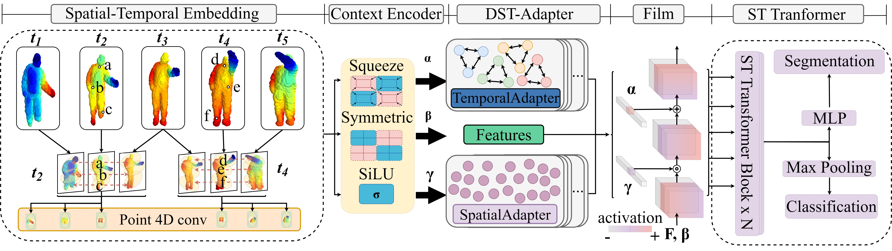

# DSTA4D: Rethinking Adaptive Spatio-Temporal Decoupling for Dynamic Point Cloud Videos

PyTorch implementation of the paper:

[DSTA4D: Rethinking Adaptive Spatio-Temporal Decoupling for Dynamic Point Cloud Videos]().

[author1]

This repository contains the official implementation for the paper "DSTA4D: Rethinking Adaptive Spatio-Temporal Decoupling for Dynamic Point Cloud Videos".

## Introduction
Understanding 4D point cloud videos is crucial for intelligent agents to perceive the dynamic changes in their external environment. However, due to the inter-frame time inconsistency and spatial disorder inherent in long-sequence point clouds, designing a unified 4D global model faces significant challenges. Existing methods primarily rely on static, monolithic network architectures that apply a uniform computational pipeline to all input data. This approach neglects the differences in spatio-temporal complexity across videos, resulting in inefficient resource allocation and limiting model's performance. To address these issues, we present a novel content-aware 4D point cloud processing approach, termed DSTA4D, which leverages dynamic spatio-temporal decoupling via adaptive modules. We first propose decoupling temporal and spatial features within the embedding layer, which avoids the complexity of full-process long-term modeling. Second, we introduce a innovative lightweight module: Dynamic Spatio-Temporal Adapter(DST-Adapter). This module dynamically generates gating weights based on the global spatio-temporal features of the input sequence and adaptively fuses features from three parallel streams: identity path, spatial enhancement path, and temporal enhancement path. This content-aware mechanism allows the model to intelligently allocate its computational focus to the most critical feature dimensions. Our experiments on mainstream benchmarks MSR-Action3D (+5.23\% accuracy), NTU RGB+D (+1\% accuracy) and Synthia4D (+1.36\% mIoU) show significant performance gains, offering a more efficient and intelligent adaptive modeling paradigm for point cloud video understanding.




## Installation

The code has been tested with the following environment:

```bash
- Python 3.9.7, g++ (GCC) 8.3.1, PyTorch v2.3.1, CUDA 12.1.

# [Optional] If you are using CUDA 12.1 or newer, please install `torch==2.3.1+cu121`
pip install torch==2.3.1 torchvision==0.18.1 torchaudio==2.3.1 --index-url https://download.pytorch.org/whl/cu121
```

1. Compile the CUDA layers for [PointNet++](https://arxiv.org/abs/1706.02413), which we used for furthest point sampling (FPS) and radius neighbouring search:

```bash

cd modules
python setup.py install

```

2. KNN_CUDA Follow [KNN_CUDA](https://github.com/unlimblue/KNN_CUDA) to install.

3. Pointnet2-Pytorch Follow [Pointnet2](https://github.com/erikwijmans/Pointnet2_PyTorch) to install.


## Data Preprocessing
The preprocess of the MSR-Action3D and Synthia4D datasets follows [MeteorNet](https://github.com/xingyul/meteornet)


## Training

To train the model, run the `train-msr.py` script.

**Example command:**

```bash
python train-msr.py
```

Make sure all paths in the configuration file are correctly set before running the script.

## Evaluation

To evaluate a trained model, please use the appropriate flags in the training script or run a dedicated evaluation script if provided.

**Example command:**

```bash
python train-msr.py --resume /path/to/your/checkpoint.pth
```

We provide pre-trained [weights](https://drive.google.com) in the release page. Please download the latest weights and put them in directory

## The complete code will be released soon.

## Visualization
Install [Mayavi](https://docs.enthought.com/mayavi/mayavi/installation.html) for visualization (optional). Desktop is must required.


## Acknowledgements
PointNet++ [PyTorch implementation](https://github.com/facebookresearch/votenet/tree/master/pointnet2)

[MeteorNet](https://github.com/xingyul/meteornet)

[P4Transformer](https://github.com/hehefan/P4Transformer)

[PSTNet](https://github.com/hehefan/Point-Spatio-Temporal-Convolution)

[Transformer](https://github.com/lucidrains/vit-pytorch)

[PSTTransformer)](https://github.com/hehefan/Point-Spatio-Temporal-Convolution?tab=readme-ov-file)

[PointRNN (PyTorch implementation)](https://github.com/hehefan/PointRNN-PyTorch)

[Mamba4D](https://github.com/IRMVLab/Mamba4D/tree/main#)

[Awesome Dynamic Point Cloud / Point Cloud Video / Point Cloud Sequence / 4D Point Cloud Analysis](https://github.com/hehefan/Awesome-Dynamic-Point-Cloud-Analysis)

