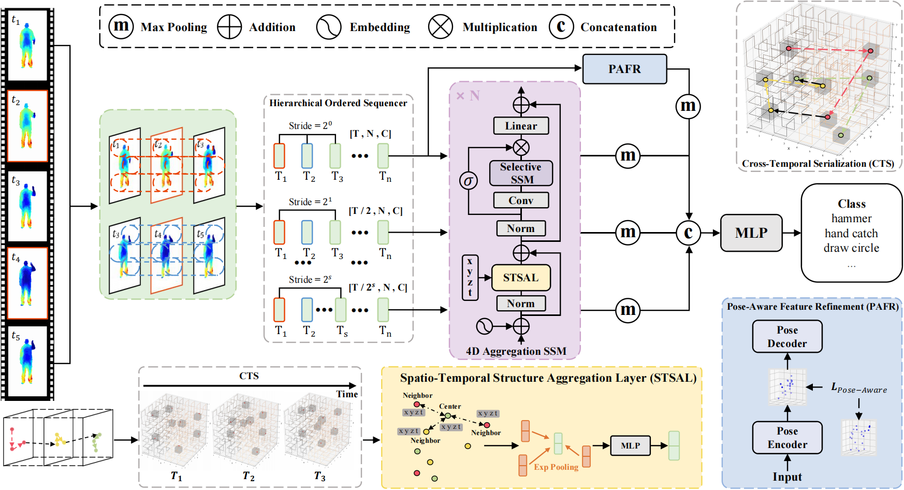

# UST-SSM

Official code for "UST-SSM: Unified Spatio-Temporal State Space Models for Point Cloud Video Modeling"



## Introduction

Point cloud videos capture complex 3D motion while reducing the effects of lighting and viewpoint variations, making them highly effective for recognizing subtle and continuous human actions. The sequential complexity of 4D point clouds poses challenges for architectures with quadratic complexity, which struggle to efficiently capture spatiotemporal dependencies. Meanwhile selective state space models, a linear-complexity alternative, have shown promising performance in sequence modeling, their unidirectional recurrent structure limits their effectiveness on spatiotemporally unordered 4D point clouds. To address these challenges, we propose Unified Spatio-Temporal State Space Models (UST-SSM), which extends recent advancements in SSMs to 4D point clouds for unified spatiotemporal modeling. Cross-Temporal Serialization (CTS) restructures unstructured 4D point clouds into ordered sequences, introducing temporal information into the unidirectional modeling of SSMs. It compresses contextual information via a selection mechanism and aggregates spatiotemporal features through a Spatio-Temporal Structure Aggregation Layer (STSAL). Furthermore, Hierarchical Ordered Sequencer (HOS) balances high-frequency details with receptive field coverage in the temporal domain and integrates Pose-Aware Feature Refinement (PAFR) to compensate for missing 4D geometric and motion details. Experimental results on the MSR-Action3D, NTU RGB+D, and Synthia 4D datasets validate the effectiveness of our method. 

## Requirements

To set up the environment for this repository, ensure you have the following dependencies:

You can install all the necessary Python packages by running:

```bash
pip install -r requirements.txt
```

### Additional Dependencies

1. **CUDA Layers for PointNet++**  

   ```bash
   cd modules
   python setup.py install
   ```

2. **kNN**  

   ```bash
   pip install --upgrade https://github.com/unlimblue/KNN_CUDA/releases/download/0.2/KNN_CUDA-0.2-py3-none-any.whl
   ```

3. **SSM**  

   ```bash
   pip install causal-conv1d
   pip install mamba-ssm
   ```

For more detailed settings, you can refer to the `requirements.yml` file.（Tested on: PyTorch 1.12.0 Python3.8 CUDA11.3）

## Datasets

### MSR-Action3D

1. Download the **MSR-Action3D** dataset from [Google Drive](https://drive.google.com/file/d/1djwAK3oZTAIFbCz531eClxINmsZgGO_H/view?usp=sharing).

2. After downloading, extract the `.zip` file to obtain the `Depth.rar` file. 

3. Once the data is extracted, navigate to the directory containing the depth data, and run the following preprocessing script to convert the depth maps into the required format for training:

   ```bash
   python scripts/preprocess_file.py --input_dir /path/to/Depth --output_dir processed_data --num_cpu 11
   ```


### NTU RGB+D

Download the **NTU RGB+D** dataset from the official website: 
[NTU RGB+D Action Recognition Dataset](https://rose1.ntu.edu.sg/dataset/actionRecognition/)

After downloading, use the following script to convert depth maps to point cloud data:

```bash
python scripts/depth2point4ntu120.py
```

### Synthia 4D

You can download the **Synthia 4D** dataset from the official website: 
[Synthia 4D Dataset](http://cvgl.stanford.edu/data2/Synthia4D.tar)
